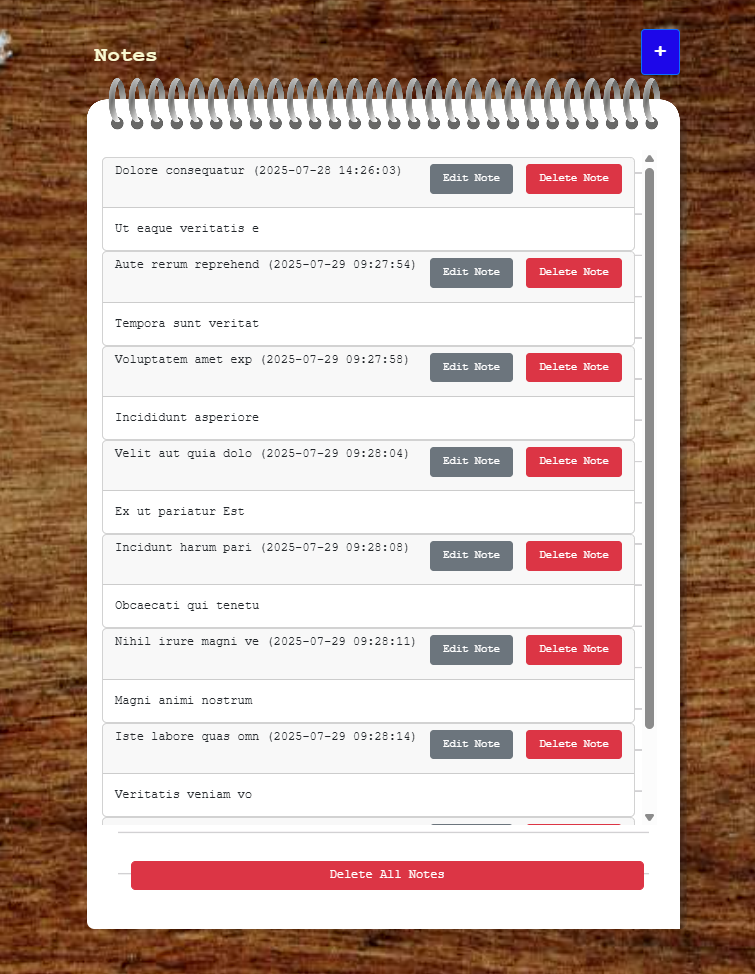
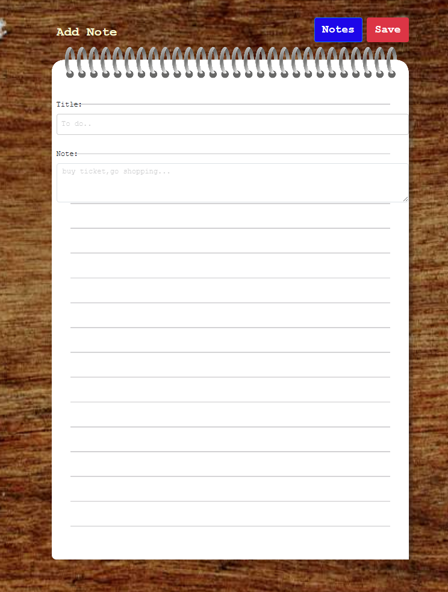
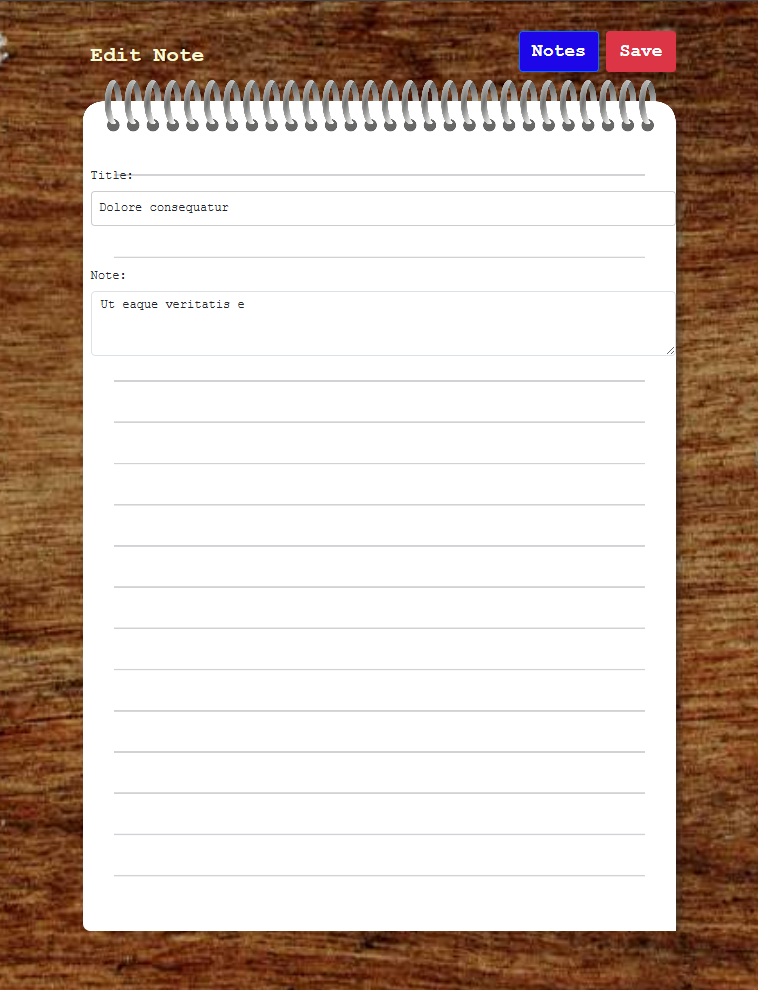

# 📝 Note Taking Application - Personal Note Management System

A modern and user-friendly note-taking application built with PHP and Smarty template engine.

## 🌟 Features

- ✅ **Add Notes** - Create new notes with title and content
- ✏️ **Edit Notes** - Update existing notes
- 🗑️ **Delete Notes** - Individual or bulk note deletion
- 💾 **JSON Storage** - File-based data storage
- 🎨 **Responsive Design** - Mobile-friendly interface with Bootstrap
- 🚀 **Clean URLs** - RESTful routing structure

## 🛠️ Technologies

- **PHP 8.0+** - Backend development
- **Smarty 4.x** - Template engine
- **Bootstrap 5** - CSS framework
- **Composer** - Dependency management
- **JSON** - Data storage

## 📁 Project Structure

```
not-defteri-main/
├── 📄 index.php              # Main entry point
├── 📄 routes.php             # URL routing definitions
├── 📄 smarty.php             # Smarty configuration
├── 📄 helpers.php            # Helper functions
├── 📄 note.php               # Note class
├── 📄 notes.json             # Note data (JSON)
├── 📄 style.css              # Custom CSS styles
├── 📄 composer.json          # PHP dependencies
├── 🎛️ controllers/           # Controller classes
│   ├── HomeController.php    # Home page controller
│   └── NotesController.php   # Note operations controller
├── 🎨 templates/             # Smarty template files
│   ├── head.tpl              # HTML head section
│   ├── header.tpl            # Page header
│   ├── footer.tpl            # Page footer
│   └── pages/                # Page templates
├── 📁 templates_c/           # Compiled templates
├── 🖼️ img/                   # Image files
└── 📦 vendor/                # Composer packages
```

## 🚀 Installation

### Requirements

- PHP 8.0 or higher
- Composer
- Web server (Apache/Nginx)

### Step-by-Step Installation

1. **Clone the project**
```bash
git clone <repository-url>
cd not-defteri-main
```

2. **Install dependencies**
```bash
composer install
```

3. **Set file permissions**
```bash
# Linux/macOS
chmod 755 templates_c/
chmod 644 notes.json

# Windows
# Set folder permissions manually
```

4. **Start web server**
```bash
# PHP built-in server
php -S localhost:8000

# Or run with Apache/Nginx
```

5. **Access the application**
```
http://localhost:8000
```

## 🎯 Usage

### Home Page
- View all your notes
- Organized list in card format
- Quick access buttons

### Adding Notes
```
GET  /notes/create - New note form
POST /notes/store  - Save note
```

### Editing Notes
```
GET  /notes/{id}/edit - Edit form
POST /notes/{id}/update - Update note
```

### Deleting Notes
```
POST /notes/{id}/delete - Individual deletion
POST /notes/delete-all  - Bulk deletion
```

## 📊 API Endpoints

| Method | URL | Description |
|--------|-----|-------------|
| `GET` | `/` | Home page - note list |
| `GET` | `/notes/create` | New note creation form |
| `POST` | `/notes/store` | Save new note |
| `GET` | `/notes/{id}/edit` | Note editing form |
| `POST` | `/notes/{id}/update` | Update note |
| `POST` | `/notes/{id}/delete` | Delete note |
| `POST` | `/notes/delete-all` | Delete all notes |

## 🗂️ Data Structure

### notes.json Format
```json
{
  "1": {
    "id": 1,
    "title": "Note Title",
    "content": "Note content...",
    "date": "2025-01-15",
    "created_at": "2025-01-15 10:30:00"
  }
}
```

## 🎨 Template Structure

### Smarty Template Hierarchy
```
templates/
├── head.tpl      # <head> section, CSS/JS links
├── header.tpl    # Navbar and header
├── footer.tpl    # Footer and closing tags
└── pages/        # Page contents
    ├── home.tpl      # Home page
    ├── create.tpl    # Note creation
    └── edit.tpl      # Note editing
```

### Template Variables
```php
// Sending data from controller to template
$smarty->assign('notes', $notes);
$smarty->assign('note', $note);
$smarty->assign('title', 'Page Title');
```

## 🔧 Development

### Adding New Controller
```php
<?php
class NewController {
    public static function index() {
        global $smarty;
        // Controller logic
        $smarty->display('pages/new.tpl');
    }
}
```

### Adding New Route
```php
// routes.php
$routes['/new-page'] = 'NewController::index';
```

### CSS Customization
```css
/* style.css */
.custom-note-card {
    border-radius: 10px;
    box-shadow: 0 2px 10px rgba(0,0,0,0.1);
}
```

## 🐛 Debugging

### Log Files
```bash
# PHP error log
tail -f /var/log/php_errors.log

# Smarty compile errors
ls -la templates_c/
```

### Common Errors
1. **Template compile error**: `templates_c/` folder permissions
2. **JSON write error**: `notes.json` file permissions
3. **Route not found**: Check `routes.php`

## 📝 Development Notes

### Planned Features
- [ ] User authentication system
- [ ] Note categories
- [ ] Search functionality
- [ ] Export/Import (PDF, TXT)
- [ ] Dark mode
- [ ] Mobile application

---

## 📸 Screenshots

### Home Page


### All Notes


### Adding Note


### Editting Note


---
